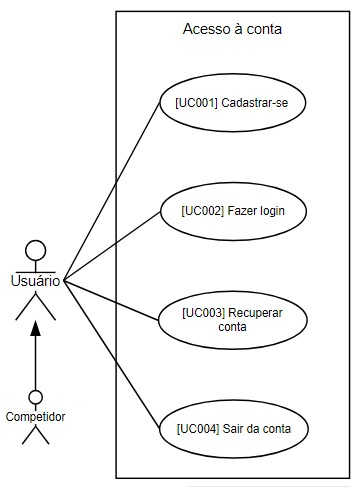

{ .m-auto}
Fonte: autoria própria
{ .txt-center}

***

### [UC001] Cadastrar-se

|||
|---|---|
| Descrição | Este caso de uso descreve o processo pelo qual um usuário pode criar uma nova conta no sistema    |
| Ator principal | Usuário |
| Pré-condição | O usuário não possui uma conta existente no sistema. |
| Pós-condição | O usuário tem uma nova conta criada e pode fazer login no sistema utilizando as credenciais fornecidas durante o processo de criação de conta. |
| Fluxo principal | 1. O usuário acessa a página de criação de conta no sistema.   2. O sistema exibe um formulário de criação de conta com os campos necessários, como nome de usuário, endereço de e-mail e senha.   3. O usuário preenche os campos do formulário com as informações necessárias.   4. O usuário clica no botão "Criar Conta".   5. O sistema valida os dados inseridos pelo usuário, verificando se o nome de usuário e o endereço de e-mail são únicos e se a senha atende aos critérios de segurança.   6. Se os dados forem válidos, o sistema cria uma nova conta para o usuário, armazenando as informações fornecidas no banco de dados.   7. O sistema envia um e-mail de confirmação para o endereço de e-mail fornecido pelo usuário, contendo um link de ativação da conta.   8. O usuário verifica sua caixa de entrada de e-mail e clica no link de ativação para confirmar a criação da conta.   9. O sistema registra a confirmação da conta e redireciona o usuário para a página de login. |
| Fluxos alternativos | No passo 6, se os dados não forem válidos (por exemplo, o nome de usuário ou o endereço de e-mail já estão em uso ou a senha não atende aos critérios), o sistema exibe uma mensagem de erro correspondente e solicita que o usuário corrija os campos inválidos.   No passo 8, se o usuário não receber o e-mail de confirmação, ele pode solicitar o reenvio do e-mail ou entrar em contato com o suporte para obter assistência. |

### [UC002] Fazer Login

|||
|---|---|
| Descrição | Este caso de uso descreve o processo pelo qual um usuário pode fazer login em sua conta existente no sistema. |
| Ator principal | Usuário |
| Pré-condição | O usuário possui uma conta registrada no sistema. |
| Pós-condição | O usuário está autenticado no sistema e tem acesso às funcionalidades disponíveis para usuários autenticados. |
| Fluxo principal | 1. O usuário acessa a página de login do sistema.   2. O sistema exibe um formulário de login com os campos necessários, como nome de usuário (ou e-mail) e senha.   3. O usuário insere suas credenciais de login nos campos correspondentes.   4. O usuário clica no botão "Fazer Login".   5. O sistema verifica as credenciais fornecidas pelo usuário, comparando-as com as informações armazenadas no banco de dados.   6. Se as credenciais estiverem corretas, o sistema autentica o usuário e o redireciona para a página inicial do sistema, onde ele tem acesso às funcionalidades disponíveis para usuários autenticados.   7. Se as credenciais estiverem incorretas, o sistema exibe uma mensagem de erro informando ao usuário que as informações de login estão inválidas.   8. O usuário pode tentar novamente inserindo as credenciais corretas ou selecionar a opção "Esqueci minha senha" para redefini-la. |
| Fluxos alternativos | No passo 7, se o usuário selecionar a opção "Esqueci minha senha", o sistema pode redirecioná-lo para um processo de recuperação de senha, onde ele pode fornecer um endereço de e-mail associado à conta para receber instruções de redefinição de senha.   Se houver um número máximo de tentativas de login, o sistema pode bloquear a conta temporariamente após um determinado número de tentativas malsucedidas para proteger contra ataques de força bruta. |

### [UC003] Recuperar conta

|||
|---|---|
| Descrição | Este caso de uso descreve o processo pelo qual um usuário pode redefinir sua senha, caso a tenha esquecido. |
| Ator principal | Usuário |
| Pré-condição | O usuário possui uma conta registrada no sistema. |
| Pós-condição | O usuário tem sua senha redefinida e pode fazer login no sistema utilizando a nova senha. |
| Fluxo principal | 1. O usuário acessa a página de recuperação de senha do sistema.   2. O sistema exibe um formulário de recuperação de senha com um campo para inserir o endereço de e-mail associado à conta.   3. O usuário insere o endereço de e-mail associado à conta no campo correspondente.   4. O usuário clica no botão "Enviar".   5. O sistema verifica se o endereço de e-mail fornecido corresponde a uma conta existente no sistema.   6. Se o endereço de e-mail for válido, o sistema envia um e-mail de recuperação de senha para o endereço de e-mail fornecido, contendo um link para redefinir a senha.   7. O usuário verifica sua caixa de entrada de e-mail e clica no link de redefinição de senha.   8. O sistema redireciona o usuário para a página de redefinição de senha, onde ele pode inserir uma nova senha.   9. O usuário insere uma nova senha nos campos correspondentes.   10. O usuário confirma a nova senha, inserindo-a novamente nos campos de confirmação.   11. O usuário clica no botão "Redefinir Senha".   12. O sistema valida a nova senha, verificando se ela atende aos critérios de segurança.   13. Se a nova senha for válida, o sistema atualiza a senha da conta do usuário no banco de dados.   14. O sistema redireciona o usuário para a página de login, onde ele pode fazer login no sistema utilizando a nova senha. |
| Fluxos alternativos | No passo 6, se o usuário não receber o e-mail de recuperação de senha, ele pode solicitar o reenvio do e-mail ou entrar em contato com o suporte para obter assistência.   No passo 13, se a nova senha não for válida (por exemplo, não atender aos critérios de segurança), o sistema exibe uma mensagem de erro correspondente e solicita que o usuário insira uma nova senha. |

### [UC004] Sair da conta

|||
|---|---|
| Descrição | Este caso de uso descreve o processo pelo qual um usuário pode sair de sua conta no sistema. |
| Ator principal | Usuário |
| Pré-condição | O usuário está autenticado no sistema. |
| Pós-condição | O usuário não está mais autenticado no sistema e não tem mais acesso às funcionalidades disponíveis para usuários autenticados. |
| Fluxo principal | 1. O usuário clica no botão "Sair" no menu de navegação.   2. O sistema encerra a sessão do usuário e o redireciona para a página de inicial. |
